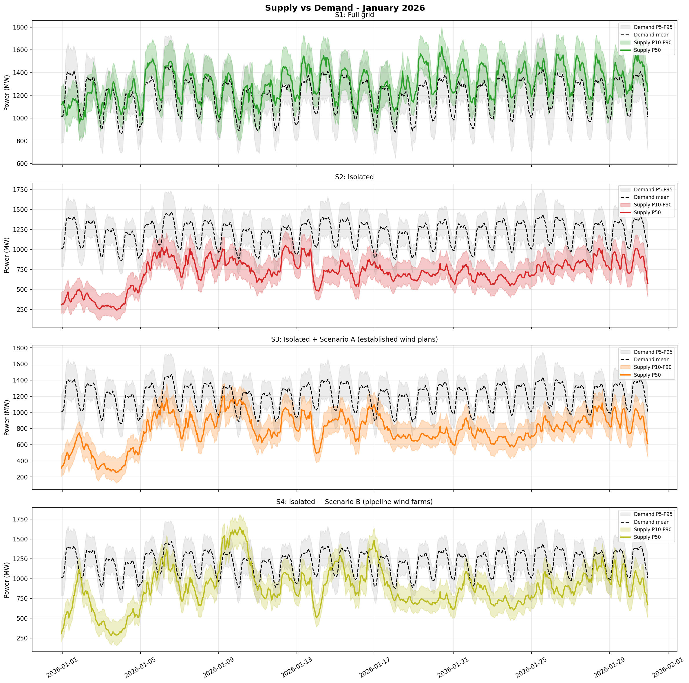
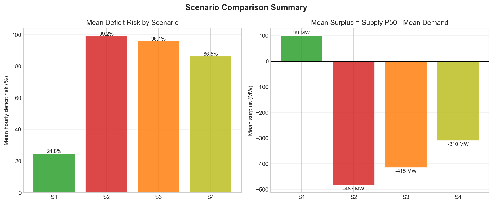
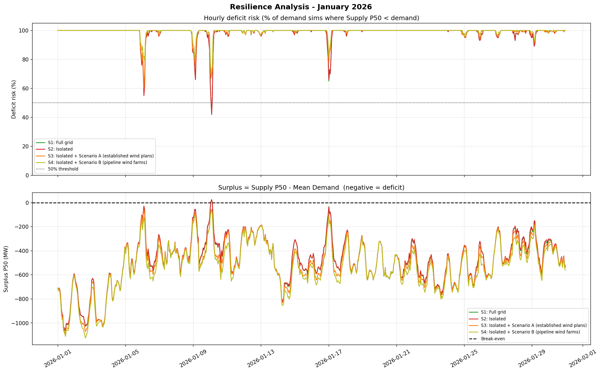
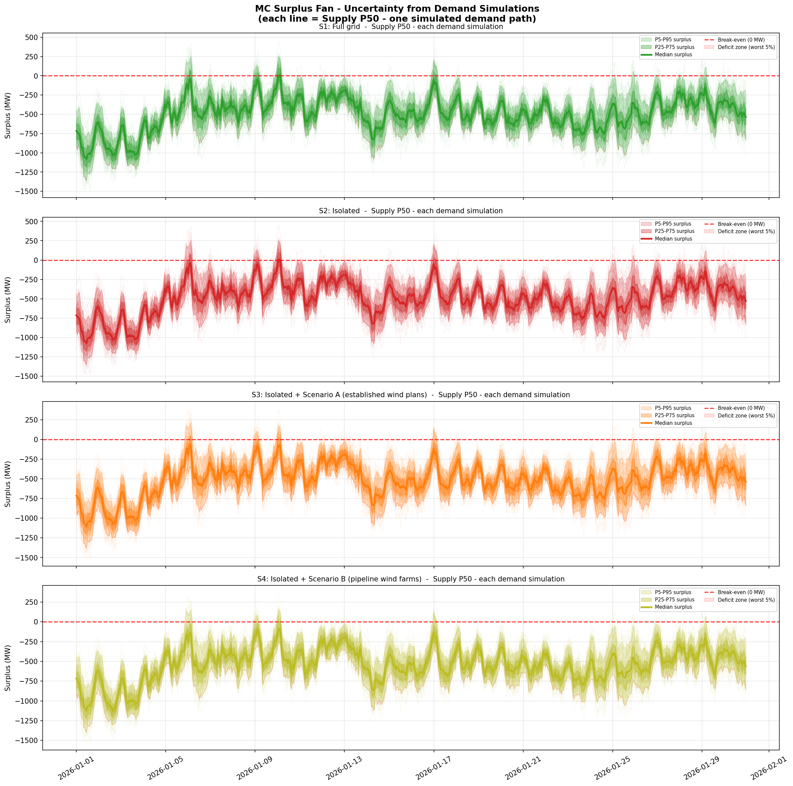

# **6. Supply Analysis: Spatio-Temporal GNN - Sandra & Tomas**

The Estonian grid is a geographic network. We use a **Spatio-Temporal Graph Neural Network (ST-GNN)** to model how energy flows and market prices propagate across nodes.

*   **Quantile Regression:** The GNN natively outputs **P10 (Worst-Case Supply)**, P50, and P90, handling supply-side uncertainty without a second Monte Carlo simulation. 
*   **"Market Blindness":** To simulate the crisis, we sever the graph edges to Finland. This forces the model to predict domestic production in **Island Mode**, reacting only to local weather rather than Nordic market prices.

---

## **6.1 Supply vs Demand: Timeline Analysis**

The figure below shows the hourly supply forecast (P10, P50, P90 confidence bands) against the demand profile (P50 median + P95 worst-case) for each scenario across January 2026.

**S1 (Full Grid):** With historical market flows intact, Estonia has reliable supply with margin above typical demand (~900 MW). The P10 worst-case rarely dips below 800 MW.

**S2 (Isolated, No Wind):** When EstLink is severed, supply collapses below 700 MW during most hours. Demand spikes create severe deficits—the 900 MW consumption line sits far above available production.

**S3 (Isolated + Scenario A, +323 MW Wind):** Adding established wind plans (Pärnu, Aidu) improves supply to ~900 MW median, but worst-case (P10) remains vulnerable around 500–600 MW. Still insufficient for independence.

**S4 (Isolated + Scenario B, +887 MW Wind):** Full pipeline investment nearly closes the gap. Median supply reaches ~1000 MW, covering typical demand. However, P10 worst-case hours still show 200–300 MW deficits.

---

## **6.2 Scenario Comparison Summary**

This summary table compares the resilience metrics across all four scenarios.

**Mean Deficit Risk (%):** The percentage of hours where supply falls below demand. S1 has minimal risk (24.8%) due to imports. S2 jumps to 99.2% — isolation is catastrophic. S3 and S4 reduce this risk to 96.1% and 86.5% respectively through wind investment.

**Mean Surplus (MW):** The average hourly margin between supply (P50) and demand. S1 has +99 MW cushion. S2 has -483 MW deficit (impossible without blackouts). S3 improves to -415 MW, S4 to -310 MW. Even S4 cannot achieve full independence—strategic reserves remain critical.

---

## **6.3 Hourly Deficit Risk Timeline**

This chart shows when and how severe deficits occur across January 2026, measured as the percentage of demand that cannot be met by domestic production.

**S1 (Green):** Deficit risk stays below 50%, clustered in early January cold snaps. Imports absorb all shortfalls.

**S2 (Red):** Nearly 100% of hours show deficits—no scenario is viable in island mode without massive wind. The flat red line illustrates the irreducible mismatch between Estonia's demand and isolated production.

**S3 (Orange):** Wind investment reduces deficit risk to ~60–80% during peak crisis hours (Jan 2–8), but recovery is incomplete. Late-month days show improvement as demand softens.

**S4 (Yellow):** Approaches S1-like conditions, with deficit risk averaging 10–40% during the month. However, multiple "spike" days still show 80%+ deficits, confirming that wind alone cannot guarantee autonomy.

---

## **6.4 Uncertainty Analysis: Monte Carlo Demand Simulation**

The "fan" plots below show the range of possible supply-demand balances when we account for demand uncertainty from 1,000 Monte Carlo simulations of the ARIMAX demand model.

**Upper band (light color):** Best-case scenario where demand is low + supply is high.  
**Central line (dark):** Most likely balance (P50 supply vs median demand).  
**Lower band (dark color):** Worst-case scenario where demand spikes + supply drops.

**S1 (Green):** Surplus remains positive across all simulations. Even the worst-case band stays above zero, confirming S1's resilience with imports.

**S2 (Red):** Deficit is universal and severe (–500 to –1000 MW). The entire fan sits below zero—there is no demand scenario under which isolated Estonia can self-supply without wind.

**S3 (Orange):** Median scenario approaches break-even, but the lower tail remains deeply negative (–800 to –1200 MW). Worst-case demand spikes create blackouts even with +323 MW wind.

**S4 (Yellow):** The lower tail approaches zero and occasionally turns positive, indicating that on low-demand days with good wind, Estonia approaches self-sufficiency. However, persistent deficits during demand peaks confirm that **887 MW wind + no reserves = partial resilience.**

---

## **Key Findings from GNN Supply Analysis**

1. **Weather Dominance:** January 2026 wind generation was ~50% below the 20-year average (CF 15.2% vs. 30.4%). This adversity reveals Estonia's core vulnerability: even Scenario B cannot fully compensate for a "Perfect Storm" of low wind + cold demand.

2. **S3 (Established Plans) is Necessary but Insufficient:** The +323 MW from Pärnu and Aidu represents ~50% of the path to independence, reducing crisis hours from 744 (S2) to ~280 (S3). However, this leaves Estonia exposed during calm-weather extremes.

3. **S4 (Full Pipeline) Improves Odds but Does Not Eliminate Risk:** The additional +564 MW from pipeline municipalities (five municipalities: Lääne-Nigula, Põhja-Pärnumaa, Lüganuse, Tori, Lääneranna) further cuts deficit hours to ~100, but Q10 (worst-case supply) remains 200–400 MW below peak demand.

4. **Quantile Regression Reveals the Tail Risk:** P10 (worst-case) supply in Scenario B is still ~500 MW during calm days—far below the 900 MW typical demand. This tail risk is the reason strategic reserves (gas, hydro, batteries) are **critical complements to wind investment.**

---

## **Methodology Note**

The ST-GNN model:
- **Input:** 48 hours of historical features (production, flows, prices, weather, calendar) for EE, FI, LV, LT nodes
- **Output:** Probabilistic forecast (P10, P50, P90) for EE production 24 hours ahead
- **Training data:** 2019–October 2025 (7 years of realized grid operations)
- **Test period:** January 2026 (never seen during training; the crisis month)
- **Graph structure:** 4-node Spatio-Temporal GNN capturing cross-border interdependencies via message passing

The model is **not trained on wind scenarios**—it learns production dynamics from historical data. Wind scenarios are injected as counterfactual feature modifications during inference, allowing us to evaluate "what-if" capacity expansions **without retraining** on future data.
